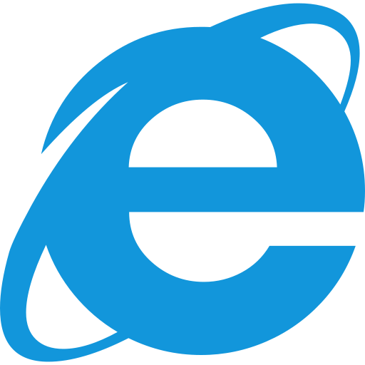
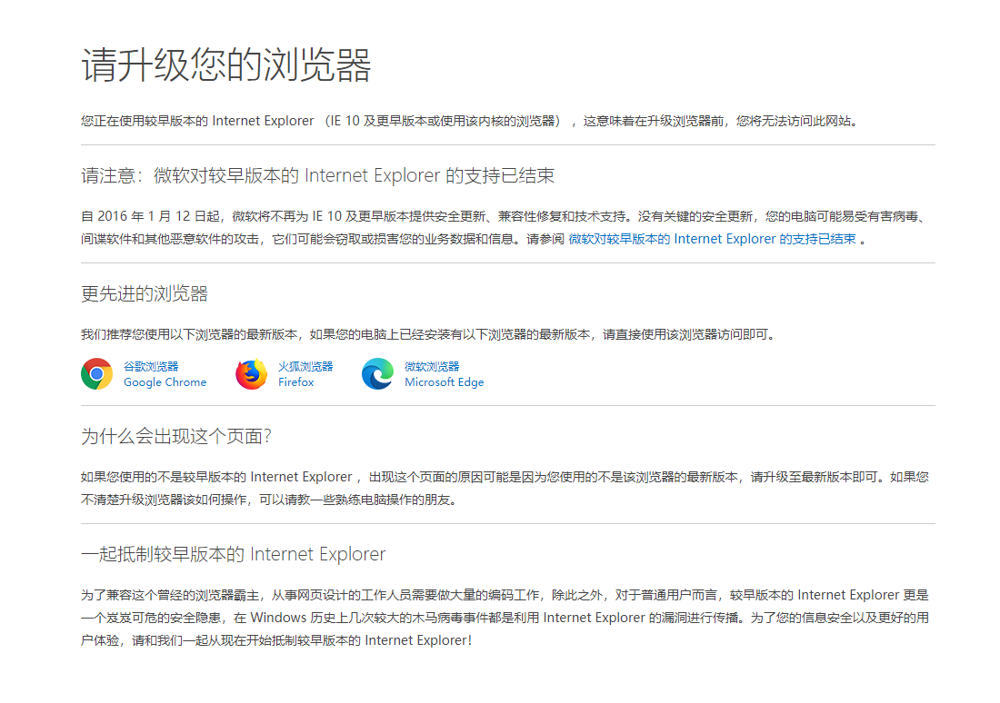

# upgrade-your-browser

<a href="https://github.com/kuriv/upgrade-your-browser">
    
</a>

> 请升级您的浏览器。

[![build][build-image]][build-url]
[![version][version-image]][version-url]
[![license][license-image]][license-url]

## 安装

**Git**

```
git clone https://github.com/kuriv/upgrade-your-browser.git
```

**npm**

```
npm install @kuriv/upgrade-your-browser
```

## 请升级您的浏览器

自 2016 年 1 月 12 日起，微软将不再为 IE 10 及更早版本提供安全更新、兼容性修复和技术支持。没有关键的安全更新，您的电脑可能易受有害病毒、间谍软件和其他恶意软件的攻击，它们可能会窃取或损害您的业务数据和信息。请参阅 [微软对较早版本的 Internet Explorer](https://www.microsoft.com/zh-cn/microsoft-365/windows/end-of-ie-support) 的支持已结束 。

## 预览




[build-image]: https://img.shields.io/badge/build-passing-brightgreen   "build"
[build-url]: https://github.com/kuriv/upgrade-your-browser    "build"
[version-image]: https://img.shields.io/badge/version-v1.0.5-blue   "version"
[version-url]: https://github.com/kuriv/upgrade-your-browser  "version"
[license-image]: https://img.shields.io/badge/license-MIT-green "license"
[license-url]: https://opensource.org/licenses/MIT  "license"